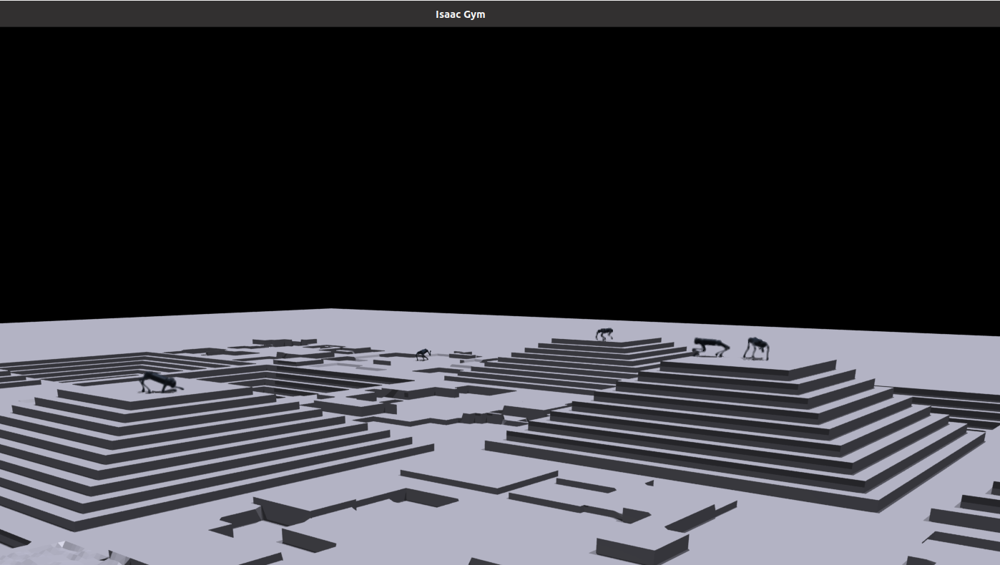
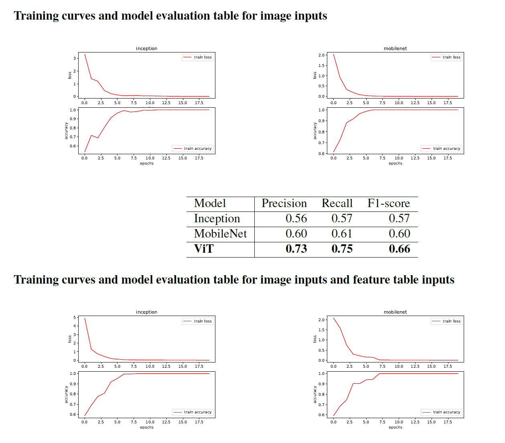

<!-- add a statement of research problems that I want to solve here. -->

<!-- Current projects -->
------
**Data driven deep reinforcement learning based quadrupedal robot control and locomotion development**\
***Internship project in Unitree Robotics***\
\
• Developed the novel quadrupedal robot locomotion and controls framework with deep reinforcement learning that increases the robot payload by 15% compared with traditional model-based control framework\
• Trained the quadrupedal robot locomotion and controls policy based on deep reinforcement learning with Isaac Gym\
• Developed the quadrupedal robot learning-based locomotion and controls model deployment program with C++\
• Conduct quadrupedal robot multi-gaits walking test using trained deep reinforcement learning control policy and analyzed the test data for sim-to-real evaluation\
• Developed the quadrupedal robot state estimator using sensor fusion techniques based on Extended Kalman Filter, increasing the estimation accuracy by 23%\
Example video can be found [here](https://github.com/Qianzhong-Chen/Qianzhong-Chen.github.io/blob/master/files/unitree_video.mp4).

**Development on Autonomous Unmanned Aerial Vehicles (UAV)**\
***Research Assistant, Advanced Controls and Research Laboratory, UIUC***\
<!-- \ -->
\
Supervisor: Dr. Naira Hovakimyan, Professor of Mechanical Science and Engineering Department, UIUC\
• Developed a collision-free bilevel trajectory optimization system with optimal waypoints’ temporal and spatial assignment for autonomous quadrotor’s motion planning based on convex optimization, increasing the computational efficiency by 150%. The work has been published on IEEE RA-L and presented on IROS 2023, the paper can be found [here](https://ieeexplore.ieee.org/document/10117594)\
• Deployed the trajectory generation program together with path planning system on Nvidia TX2 onboard computer\
• Co-designed and manufactured the prototype of omnidrone, a new type of fully-actuated UAV with six motors\
• Designed and conducted experiments to evaluate different motors’ thrust- and torque-throttle curves under different battery conditions based on NI-DAQ and LabView

**Deep Learning for Glaucoma (an ophthalmic disease) Detection with Medical Images**\
***Team Leader, Course Project of CS 229 Machine Learning***
\
• Preprocessed medical images, including image resizing, noise reduction, essential feature extraction\
• Conduct training with 3 CNN models (ResNet101, VGG16, MobileNet) on preprocessed dataset\
• Aiming at small dataset (500 images), conduct different methods including data augmentation, different splitting, fine-tunning the pre-trained model and cross validation, increasing the detection precision by 7%\
• Trained the images with Vision Transformer, achieving detection precision of 75%\
Project final paper can be found [here](https://github.com/Qianzhong-Chen/Qianzhong-Chen.github.io/blob/master/files/cs229_final_project.pdf), poster can be found [here](https://github.com/Qianzhong-Chen/Qianzhong-Chen.github.io/blob/master/files/cs229_poster.pdf).

